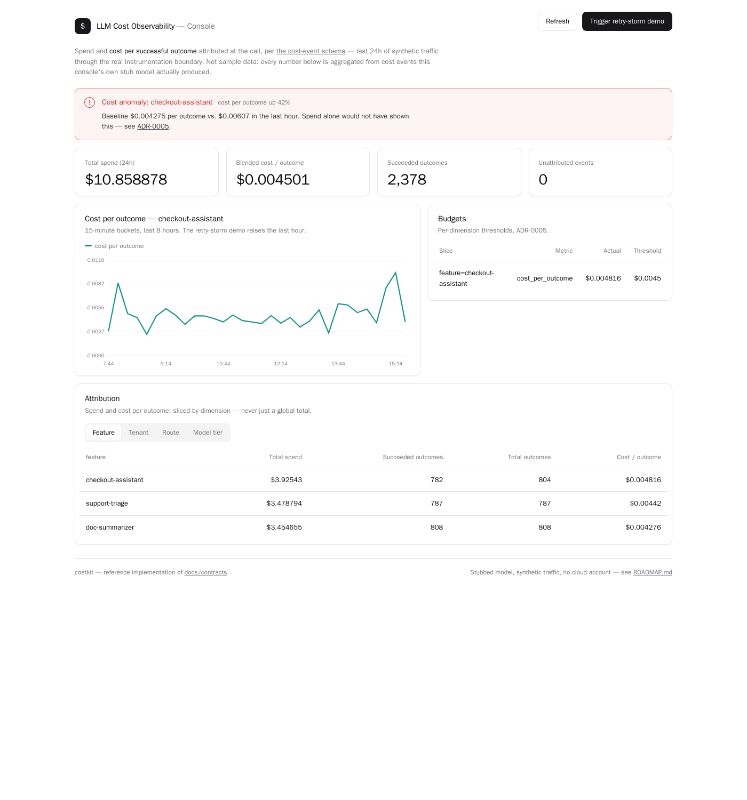

# LLM Cost Observability

> Gasto com LLM é um sinal operacional, não uma surpresa mensal. Atribua cada token à feature, ao
> tenant e à requisição que o causou — e meça custo por resultado bem-sucedido, não custo por token.
> Documentado primeiro, neutro de fornecedor, implementado em público.

A maioria dos times descobre o custo de suas features de IA pela fatura — um número, um mês depois,
sem forma de dizer qual feature, qual tenant ou qual mudança o elevou. Quando uma regressão de custo
fica visível, ela já está em produção há semanas. O gasto que um bom painel de latência pegaria em
uma hora fica invisível, porque custo nunca foi instrumentado como latência foi.

A solução é tratar custo como qualquer outro sinal: medido na chamada, marcado com as dimensões que
permitem atribuí-lo, e observado com budgets e alertas de anomalia. E medir a coisa certa — não
tokens queimados, mas custo por resultado bem-sucedido, para que um modelo "barato" que falha e
tenta de novo duas vezes seja corretamente visto como o caro. Este repositório é o design disso.

**English:** [README.md](./README.md)

---

## O que já existe

| Área | Status | Link |
| --- | --- | --- |
| Contexto e escopo | Pronto | [docs/context.md](./docs/context.md) |
| Modelo de custo | Pronto | [docs/cost-model.md](./docs/cost-model.md) |
| Dimensões de atribuição | Pronto | [docs/attribution.md](./docs/attribution.md) |
| Diagramas de instrumentação | Pronto | [docs/diagrams](./docs/diagrams) |
| Registros de Decisão de Arquitetura | 6 publicados | [docs/adr](./docs/adr) |
| Contratos — schema de evento de custo, contrato de resultado, abstração de precificação | Pronto | [docs/contracts](./docs/contracts) |
| Implementação de referência — boundary, precificação, outcomes, budgets/anomalias, console | Pronto, 36 testes | [costkit](./costkit), [console](./console), [ROADMAP.md](./ROADMAP.md#milestone-3--reference-implementation) |
| Validação — drills de regressão de custo, tempestade de retries, context bloat, reconciliação de atribuição | Pronto, mais 4 testes, obrigatórios em cada push | [docs/validation](./docs/validation), [ROADMAP.md](./ROADMAP.md#milestone-4--validation) |

## A ideia

**Atribua custo na chamada, às dimensões que importam, e meça por resultado bem-sucedido.** Uma
contagem de tokens e um preço não são o número interessante; o número interessante é *esta feature
custou tanto para este tenant nesta semana, e aqui está a mudança que a moveu.* Isso exige três
coisas que a fatura não dá:

- **Atribuição na fonte** — cada chamada é marcada com feature, tenant e rota que a causaram, quando
  acontece, não reconstruída depois.
- **A unidade certa** — custo por tarefa *bem-sucedida*, para que retries, falhas e contexto inflado
  apareçam como o desperdício que são.
- **Um ponto único de instrumentação** — custo capturado em um boundary por onde toda chamada passa,
  não espalhado por call sites.

Com isso, custo vira governável: **budgets e alertas de anomalia** pegam uma regressão como um alerta
de latência pega, e um check de custo pode gatear um release antes de uma mudança cara subir.

## Gasto não é desperdício

A distinção mais útil deste repositório: **gasto** é o que uma tarefa bem-sucedida legitimamente
custa; **desperdício** é todo o resto cobrado no caminho — um retry após falha, contexto inflado bem
além do que a tarefa precisava, um modelo grande usado onde um pequeno teria respondido. Um painel
que mostra só o gasto total esconde o desperdício. Um construído sobre custo-por-resultado o revela.

> Os documentos técnicos são mantidos em inglês para alcançar o público mais amplo possível.
> Este README traz o contexto em português.

## Roadmap

Quatro fases, acompanhadas como milestones no GitHub. Detalhes em [ROADMAP.md](./ROADMAP.md).

1. **Design** — o modelo de custo, as dimensões de atribuição, o ponto de instrumentação, os ADRs — concluído
2. **Contratos** — o schema do evento de custo, o contrato de resultado e a abstração de precificação — concluído
3. **Implementação de referência** — um boundary, precificação, rastreamento de outcomes,
   budgets/detecção de anomalia e um painel, tudo real e testado (`make up`) — concluído, veja
   [console/README.md](./console/README.md) para o que é real versus stub
4. **Validação** — quatro drills (regressão de custo, tempestade de retries, context bloat,
   reconciliação de atribuição), cada um uma execução real cujo veredito é obrigatório em cada
   push via `make test` — concluído, veja [docs/validation](./docs/validation)

## Relacionados

- [k8s-observability-stack](https://github.com/prodrigues2023/k8s-observability-stack) — a plataforma geral de métricas/logs/traces; este é o sinal de custo de LLM que corre sobre ela
- [prompt-registry](https://github.com/prodrigues2023/prompt-registry) — onde um check de custo vira um gate de promoção, pegando um prompt caro antes de subir
- [agentic-patterns-catalog](https://github.com/prodrigues2023/agentic-patterns-catalog) — de onde vêm os loops de retry e o fan-out multi-agente que elevam o custo-por-resultado

## Autor

Paulo Roberto Franco Rodrigues — AI Solutions Architect.
Recentemente projetou frameworks corporativos de IA e atuou em comitê de arquitetura de IA definindo
os padrões de engenharia que trazem disciplina de software para a entrega de IA.
[LinkedIn](https://linkedin.com/in/paulo-roberto-franco-rodrigues)

## Licença

MIT — veja [LICENSE](./LICENSE).
