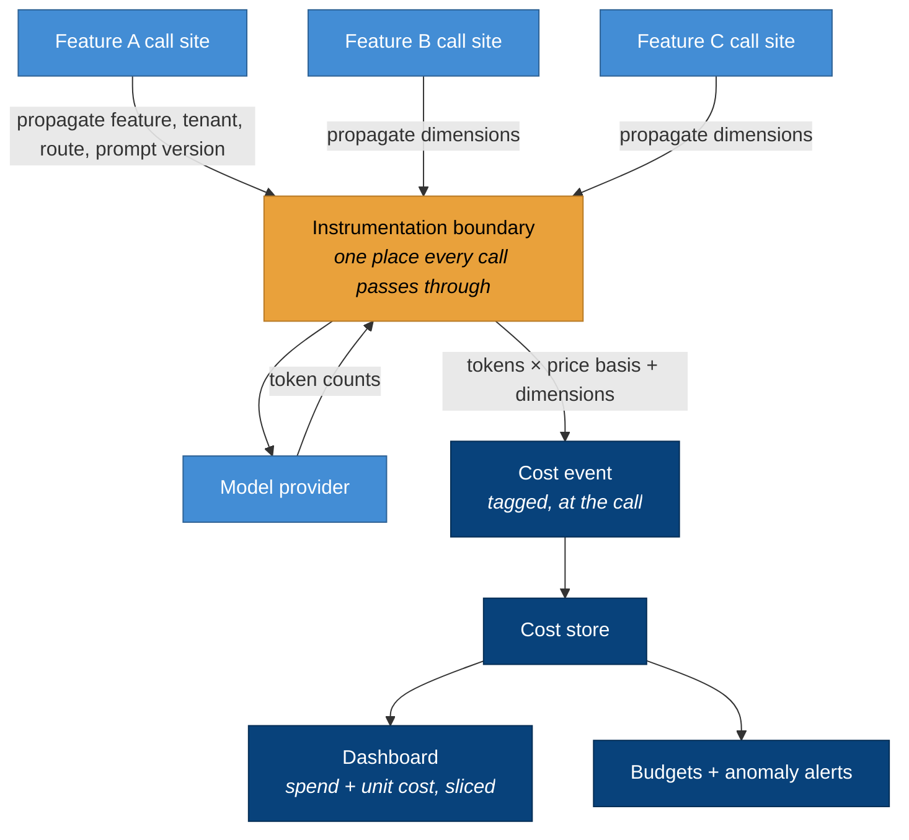
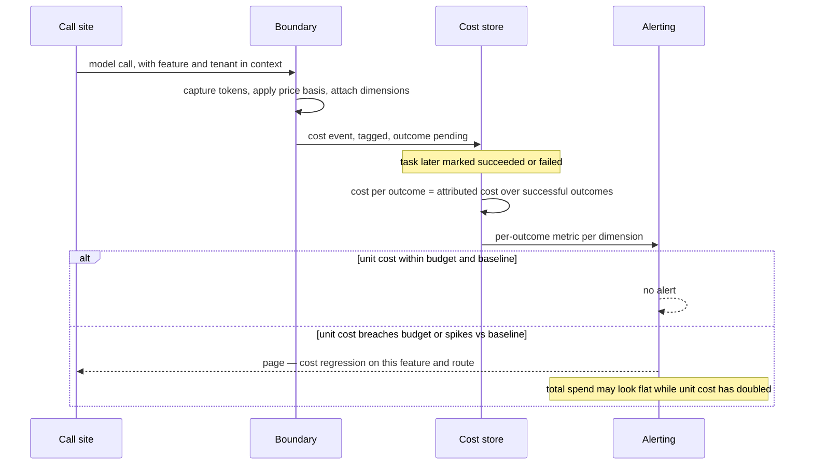

# Instrumentation and attribution flow

Two diagrams: where cost is captured, and how a tagged call becomes an attributed, alertable metric.

## The single boundary

Every model call passes through one instrumentation boundary
([ADR-0004](../adr/0004-instrument-at-the-boundary.md)). Call sites propagate dimensions; the boundary
turns a call into a cost event. Nothing computes cost at a call site.

The boundary is the load-bearing element: capture is complete and uniform because every call goes
through it ([ADR-0004](../adr/0004-instrument-at-the-boundary.md)), and attribution is exact because
the dimensions are read from the propagated context at that moment
([ADR-0002](../adr/0002-attribute-at-the-call.md)), never reconstructed later.

## From a call to an alertable regression

The sequence that catches a retry storm a total-spend chart would sleep through.

The point the sequence makes: the alert fires on **cost per outcome**
([ADR-0003](../adr/0003-cost-per-outcome.md)), so a wave of retries — which leaves total spend
looking roughly flat while the successful-outcome denominator shrinks — pushes the unit cost up and
pages someone ([ADR-0005](../adr/0005-budgets-and-alerts.md)). A dashboard watching only the total
would show nothing worth looking at.
